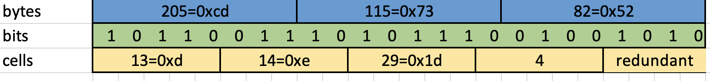

# hll

Basic implementation of [https://en.wikipedia.org/wiki/HyperLogLog](HyperLogLog)

## 5-bit counters
The algorithm uses 5-bit counters, or registers, so we need to effectively store them, i.e. support logic cells over byte arrays, see [small_cells.py](src/small_cells.py)

## Fix for large numbers

In this example, where p=11, the fixing provide better results only in some range [140M - 1.7G]

## ToDo:
* Streaming variant to improve memory efficiency
* [https://en.wikipedia.org/wiki/HyperLogLog#Streaming_HLL](HyperLogLog++) for better accuracy on large cardinalities

